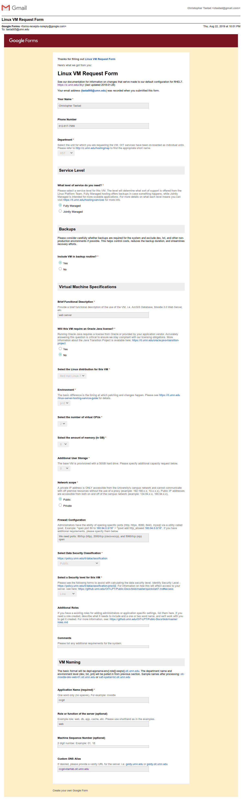

```{r include = F}
knitr::opts_chunk$set(eval = F)
```

* httpd setup
* script setup
* backup process
* crontab elements

* clone git by https
* using ssh forwarding https://developer.github.com/v3/guides/using-ssh-agent-forwarding/
* upload process

# README {.tabset .tabset-fade .tabset-pills}

## Preamble

This is the man page of the Candidate Cancer Gene Database, a product of the [Starr Lab](http://www.med.umn.edu/starrlab/) at the University of Minnesota. All considerations for ownership follow the discretion of the Starr Lab at the extension of the [policies](https://policy.umn.edu/) of the University of Minnesota. Additionally, this work has been open sourced under the permissions of the MIT License.


***


## Contact

#### Upgrade Author

Christopher Tastad

MS Candidate Bioinformatics

* University: tasta005@umn.edu
* Personal: ctastad@gmail.com
* Mobile: 612-817-7989
* github: https://github.com/ctastad

#### Original Author

Ken Abbott

MD Candidate

* email: abbot195@umn.edu

#### Faculty

Tim Starr, PhD

Assistant Professor

Dept. of OBGYN

* email: star0044@umn.edu
* office: 612-625-4425
* url: https://med.umn.edu/bio/obgyn-faculty/tim-starr


***


## License


```{r}
MIT License

Copyright (c) 2019 University of Minnesota

Permission is hereby granted, free of charge, to any person obtaining a copy
of this software and associated documentation files (the "Software"), to deal
in the Software without restriction, including without limitation the rights
to use, copy, modify, merge, publish, distribute, sublicense, and/or sell
copies of the Software, and to permit persons to whom the Software is
furnished to do so, subject to the following conditions:

The above copyright notice and this permission notice shall be included in all
copies or substantial portions of the Software.

THE SOFTWARE IS PROVIDED "AS IS", WITHOUT WARRANTY OF ANY KIND, EXPRESS OR
IMPLIED, INCLUDING BUT NOT LIMITED TO THE WARRANTIES OF MERCHANTABILITY,
FITNESS FOR A PARTICULAR PURPOSE AND NONINFRINGEMENT. IN NO EVENT SHALL THE
AUTHORS OR COPYRIGHT HOLDERS BE LIABLE FOR ANY CLAIM, DAMAGES OR OTHER
LIABILITY, WHETHER IN AN ACTION OF CONTRACT, TORT OR OTHERWISE, ARISING FROM,
OUT OF OR IN CONNECTION WITH THE SOFTWARE OR THE USE OR OTHER DEALINGS IN THE
SOFTWARE.
```


***


# Design

## Directory Maps {.tabset .tabset-fade .tabset-pills}

### Server

* site: `/swadm/var/www/ccgd/_site`
* project: `/swadm/var/www/ccgd`
* backup: `/swadm/var/www/backup`

```{r}
/swadm/
└── var
    └── www
        ├── backup          # BACKUP DIRECTORY
        ├── ccgd            # PROJECT ROOT DIRECTORY
        └── logs            # CRONJOB LOGS
```

### Project

```{r}
# All *.Rmd files are web page Rmarkdown source files.

ccgd/                       # PROJECT ROOT DIRECTORY
├── contact.Rmd
├── help.Rmd
├── img                     # dir holding site images
├── index.Rmd               # site home page source
├── LICENSE                 # copyright text
├── references.Rmd
├── refs
│   ├── ccgd_paper.bib      # bibtex file for ccgd paper download
│   ├── ccgd_refs.csv       # REFERENCES SOURCE FILE
│   ├── ccgd_rhel7_docs.html
│   └── ccgd_rhel7_docs.Rmd # ccgd docs source
├── scripts                 # maintenance script dir - see Script section
│   ├── backup.sh
│   ├── build_table.R
│   ├── build_table.sh
│   ├── ccgd_upload.sh
│   ├── email_notify.sh
│   ├── knit_site.R
│   └── sanger_pull.sh
├── search.Rmd
├── _site                   # WEB ROOT DIRECTORY
├── _site.yml               # site YAML header - see Rmarkdown section
├── styles
│   ├── favicon.html        # supplementary html to reference favicon
│   ├── footer.html         # supplementary html for footer copyright statement
│   └── styles.css          # custom css mods to Rmarkdown
└── table_app
    ├── app.R               # shiny app source
    ├── ccgd_export.csv     # TABLE SOURCE FILE
    ├── cgc_trim.txt        # trimmed cgc reference
    ├── cosmic_trim.txt     # trimmed cosmic reference
    ├── json_token_cosmic.txt   # auth token for sanger pull
    ├── legend.csv          # data for search page legend
    └── rsconnect           # shinyapps server setup. DO NOT MODIFY!

12 directories, 41 files
```


***


### Backup

```{r}
backup/
├── ccgd_rhel6_archive_20191123.tar.gz
├── site                    # tarball archive of project root directory
└── source_files
    ├── refs                # copied backup of reference source file
    └── table               # copied backup of table source file

4 directories

```


***


## Server

### OIT Hosting

Hosting for the CCGD is provided free of charge by OIT via the [Health Sciences Technology](https://hub.ahc.umn.edu/technology-information-systems) (HST) department (formerly AHC IT).

* OIT linux server hosting: https://it.umn.edu/linux-server-hosting-service-guide

The hosting arrangement we have with OIT is termed *Fully Managed*. Contrary to the implications of that name, the management of this server is limited to some degree in both admin privledges and responbility. With this, OIT will retain full, root access and perform regular system backups. OIT then provides a chef role to allow for limited root capabilities to perform the actions necessary for the deployment of our application.

#### Site Address

* Aliases:
    + http://z.umn.edu/ccgd (Alias)
    + http://ccgd-starrlab.oit.umn.edu (Alias)
    + http://hst-ccgd-prd-web.oit.umn.edu (Actual address)

#### Documentation

With OIT hosted servers, there is some documentation. This can be lacking at times, but any topic that isn't adequately covered in the CCGD man page is likely detailed in OIT's repository.

* https://github.umn.edu/OIT-LPT/Public-Docs

#### Server Request

Several threads were necessary to both gain access to the existing server and then receive approval for a new machine.

<details>
  <summary>Email thread with Satish to gain access</summary>

```{r}

Hi Jeff,

Thank you for your response. oialinux@umn.edu was actually the first point of contact I made, and they directed me to HST. I've cc'd the contact who handled the this response.


Satish,

Would we be able to make sense of the discrepancy in administration here?


Thank you,
--
Christopher Tastad

<ctastad@gmail.com>
Mobile: 612-817-7989


On Wed, Jul 17, 2019 at 11:34 AM Jeffrey Sik <sikxx005@umn.edu> wrote:

    Hi Christopher,

    Unfortunately I do not have access to this box and digging further it looks like it's over on OIT's infrastructure. You could try emailing oialinux@umn.edu which is the linux group over there.

    Hope this helps!
    Thanks,


    Jeffrey Sik

    UNIVERSITY OF MINNESOTA
       HST Systems Administrator
       Email: sikxx005@umn.edu Phone: (612) 624-9148


    On Fri, Jul 12, 2019 at 3:35 PM Christopher Tastad <tasta005@umn.edu> wrote:

        Hello,

        I'm forwarding this on looking for some assistance gaining access to a server that is under the management of HST. Would any of you be able to point me in the right direction?


        Thank you,
        --
        Christopher Tastad

        <ctastad@gmail.com>
        Mobile: 612-817-7989


        ---------- Forwarded message ---------
        From: Christopher Tastad <tasta005@umn.edu>
        Date: Tue, Jul 9, 2019 at 4:54 PM
        Subject: Fwd: INC2271719 Update: tasta005@umn.edu - Server Access - CCGD Starr lab - INC2271719 satishs
        To: <kell@umn.edu>
        Cc: Tim Starr <star0044@umn.edu>


        Hello,

        I am reaching out on behalf of the Starr lab regarding an HST hosted server. I will be taking over a required upgrade for this server and need to start by getting access. The server is running RHEL, and I believe the host site is:

        ccgd-starrlab.oit.umn.edu

        Other points of contact I've been given are Jeffrey Sik, Colby Reese, Nathan Huff. If I should contact one of them, please let me know. Otherwise, please advise on how I should proceed.


        Thank you,
        --
        Christopher Tastad

        <ctastad@gmail.com>
        Mobile: 612-817-7989


        ---------- Forwarded message ---------
        From: UMN Service Desk <help@umn.edu>
        Date: Tue, Jul 9, 2019 at 10:20 AM
        Subject: INC2271719 Update: tasta005@umn.edu - Server Access - CCGD Starr lab - INC2271719 satishs
        To: <tasta005@umn.edu>


        Additional comments:
        2019-07-09 10:20:14 CDT - Satish Chowdary Sadineedi (satishs) Additional comments
        Hi Chris ,

        The authorized requestors listed on this host are reese007, kell, nrhuff, sikxx005 and it belongs to HST. . Could you ask one of the authorized requestors to approve this request ?

        Thanks,
        Satish

        You can track the status of your ticket INC2271719 at any time.

        If you would like to provide more information, please reply to this email to update your ticket.

        Ref:MSG25438236


```

</details>


<details>
  <summary>Email thread with Sonya to gain access</summary>

```{r}


Hi, Christopher.

Not a problem. I've asked Satish to grant you access to that server. I've added myself to the watchlist on the ticket.

Thanks,
Sonya
---------------------------------------------------------------------
Sonya Smith Šustáček
Project Manager & Business/Systems Analyst (Infrastructure Services)
Office of Information Technology | it.umn.edu
University of Minnesota | umn.edu
ssustace@umn.edu | 612.301.2128

“We must accept finite disappointment, but never lose infinite hope.”  -- Martin Luther King, Jr.


On Wed, Jul 17, 2019 at 5:58 PM Christopher Tastad <tasta005@umn.edu> wrote:

    Hi Sonya,

    I am reaching out on behalf of the Starr lab regarding a University hosted server. I will be taking over a required upgrade for this server and need to start by getting access.

    With this, I have been having some trouble identifying who owns the administration of the server. Both OIT and HST have indicated that the other is the manager. I still have active threads with them to see if we can sort it out, but I wanted to make another point of contact since this has been a multi week process.

    I've been told reese007, kell, nrhuff, sikxx005 at HST are authorized requestors and have reached out to them with the only response being that OIT is the owner of the space.

    For reference, the server site is below, and my OIT ticket is INC2271719.

    ccgd-starrlab.oit.umn.edu

    Any assistance would be greatly appreciated.


    --
    Christopher Tastad

    <ctastad@gmail.com>
    Mobile: 612-817-7989


    ---------- Forwarded message ---------
    From: Timothy Starr <star0044@umn.edu>
    Date: Wed, Jul 17, 2019 at 4:50 PM
    Subject: Fwd: Strategy to migrate ccgd-starrlab to a RHEL 7 Server
    To: Christopher Tastad <tasta005@umn.edu>


>     Begin forwarded message:
>
>     From: Sonya Sustacek <ssustace@umn.edu>
>     Subject: Re: Strategy to migrate ccgd-starrlab to a RHEL 7 Server
>     Date: April 10, 2019 at 11:26:33 AM CDT
>     To: Ken Abbott <abbot195@umn.edu>
>     Cc: John Trammell <tram0004@umn.edu>, Tim Starr <star0044@umn.edu>, Thomas Kell <kell@umn.edu>
>
>     Hi, Ken.
>
>     It's okay that you cannot attend this meeting. Thanks so much for the information. This is helpful.
>
>     There are a couple of issues that I think it's better for Tim, HST rep, and Linux rep to get together to hammer out and make clear.
>
>     HST can request a new server for Dr. Starr. Then the question is who migrates the website (and updates Phython) to the new server? Who will support it? Does it make sense to move the site to Drupal?
>
>     We (OIT) just want to know where we go from here as things have stalled a bit.
>
>     Again, thanks for you help and good luck with medical school. :-)
>
>     Best,
>     Sonya
>     ---------------------------------------------------------------------
>     Sonya Smith Šustáček
>     Project Manager & Business/Systems Analyst (Infrastructure Services)
>     Office of Information Technology | it.umn.edu
>     University of Minnesota | umn.edu
>     ssustace@umn.edu | 612.301.2128
>
>     “We must accept finite disappointment, but never lose infinite hope.”  -- Martin Luther King, Jr.
>
>
>     On Tue, Apr 9, 2019 at 8:49 PM <abbot195@umn.edu> wrote:
>
>         Hi folks. I built this site for Tim in 2012. I’m a medical student doing 100-hour weeks (until December) so I cannot make it to this meeting, but I hope we can exchange some information via email. I think the best bet is just another RHEL server—with only a few webpages here, I think we don’t need a platform, and it could be a pain to adapt what we have now to work with a platform. I may be able to help with this, but I cannot really speculate much about how much I will be able to accomplish, according to any timetable; I would appreciate a labor estimate (and description of any known hurdles) from someone who has experience completing these RHEL migrations for other University entities.
>
>
>
>         -Ken
>
>
>
>         -----Original Appointment-----
>         From: Google Calendar <calendar-notification@google.com> On Behalf Of Sonya Sustacek
>         Sent: Tuesday, April 9, 2019 4:20 PM
>         To: abbot195@umn.edu; John Trammell; Tim Starr; kell@umn.edu
>         Subject: Strategy to migrate ccgd-starrlab to a RHEL 7 Server
>         When: Friday, April 12, 2019 2:00 PM-2:50 PM (UTC-05:00) Eastern Time (US & Canada).
>         Where: WBOB-523 OIT

```
</details>

##### VM Application

*Submitted 2019-08-22*

<details>
  <summary>Completed VM Application</summary>

</details>

<details>
  <summary>App response from Tom Kell</summary>

```{r}

Thanks for the information. I have approved it and you should be hearing from OIT hosting soon.

Tom
---------- Forwarded message ---------
From: <mptflow@umn.edu>
Date: Fri, Aug 23, 2019 at 6:23 AM
Subject: Hosting Service Request for hst-ccgd-prd-web -- linux -- Approve
To: <reese007@umn.edu>, <kell@umn.edu>, <nrhuff@umn.edu>, <sikxx005@umn.edu>


Hello,
The OIT Hosting Services request for hst-ccgd-prd-web has been Approve by kell@umn.edu.

Comments:

No further action is needed.

Thank you,
OIT Hosting Services


--

--
Thomas Kell
Server Operations Manager
Health Sciences Technology
University of Minnesota
kell@umn.edu
612-626-6219

```

</details>

<details>
  <summary>Question re firewall req</summary>

```{r}

2019-08-23 11:20:00 CDT - Thomas Bertschinger (thomasb) Additional comments
Hi Christopher,

For the custom firewall, can you confirm whether you need ports 80, 2000, and 5060 open to the world, or just to the UMN?

thanks!
-Thomas

You can track the status of your ticket INC2305839 at any time.

If you would like to provide more information, please reply to this email to update your ticket.
```
</details>

***

#### COSMIC Web Link

The CCGD is linked to via COSMIC's mouse gene portal. This needed to be updated with the address changes that took place during the update. Any future changes need to be communicated to COSMIC's webdev team to be reflected appropriately.

<details>
  <summary>Discussion w/ Sanger</summary>

```{r}
Wed Jan 29 10:22:01 2020: Request 681837 was acted upon.
Transaction: Owner set to dmb (Dave Beare) by dmb
       Queue: cosmic
     Subject: Fwd: FW: Links to mouse gene directly [EXT]
       Owner: dmb
  Requestors: tasta005@umn.edu
      Status: open
 Ticket <URL: https://rt.sanger.ac.uk/Ticket/Display.html?id=681837 >


Your ticket has been assigned to an engineer, as shown in the Owner field above.

Regards,
cosmic-admin queue
cosmic@sanger.ac.uk
```

```{r}
Dear Christopher,

Thanks for getting in touch regarding the update for the CCGD URL. I'm really sorry that we didn't get back to you about this in December. I'm not sure what went wrong there.

I've now updated the link in the live COSMIC website. You can see the new URL in, for example, our documentation page for the gene analysis overview:

https://cancer.sanger.ac.uk/cosmic/help/gene/analysis

Please do let me know if you find any CCGD links that are still broken. I'll mark this ticket as resolved for now but if you do find any issues you can re-open it by replying to this mail.

Again, thanks for letting us know about the problem and apologies for the delay in fixing it.

Best regards,

John.


On Wed Jan 29 08:53:19 2020, tasta005@umn.edu wrote:
> Hello,
>
> I am attempting to reach someone on the COSMIC web dev team who can
> help me
> in updating a element on the COMIC gene view.
>
> I am the admin for a resource which COSMIC links to. That resource has
> been
> updated, and the corresponding link address needs to be updated on
> COSMIC's
> end. Previously, the contact for this was Harry Boutselakis, but I
> didn't
> get a response from him.
>
>
>
>
> Thank you,
> --
> Christopher Tastad
>
> <ctastad@gmail.com>
> Mobile: 612-817-7989
>
>
> ---------- Forwarded message ---------
> From: Christopher Tastad <tasta005@umn.edu>
> Date: Wed, Dec 4, 2019 at 6:30 PM
> Subject: Fwd: FW: Links to mouse gene directly
> To: <hb7@sanger.ac.uk>
>
>
> Hi Harry,
>
> I received your info as a point of contact for COSMIC. I'm in the
> process
> of rebuilding the Candidate Cancer Gene Database, which COSMIC
> currently
> links to with a "mouse gene" button in the overview section of a gene
> entry.
>
> With this upgrade I'm performing, that link will break, so I wanted to
> reach out to explore what would be necessary to keep fidelity between
> our
> resources. For reference, the current and new sites are below.
>
> Current
>  https://urldefense.proofpoint.com/v2/url?u=http-3A__ccgd-
> 2Dstarrlab.oit.umn.edu_about.php&d=DwIBaQ&c=D7ByGjS34AllFgecYw0iC6Zq7qlm8uclZFI0SqQnqBo&r=IXcQRv5GIZMMlmkjkNsOyHFd2ohO51juYfeojKymDaA&m=CNdjIPXkPhkKMjcOleb_HSQ3qevCEce7bRDe3lolIto&s=MbHyQv4pIMTiUdWYv8_HpAavBvOqtUisOvMqjHCh62o&e=
>
> New
> z.umn.edu/ccgd
>
>
>
>
>
> Thank you,
> --
> Christopher Tastad
>
> <ctastad@gmail.com>
> Mobile: 612-817-7989
>
>
> ---------- Forwarded message ---------
> From: <abbot195@umn.edu>
> Date: Wed, Dec 4, 2019 at 5:38 PM
> Subject: FW: Links to mouse gene directly
> To: Christopher Tastad <tasta005@umn.edu>
>
>
>
>
>
>
> *From:* Tim Starr <star0044@umn.edu>
> *Sent:* Wednesday, June 22, 2016 5:10 PM
> *To:* abbot195 <abbot195@umn.edu>
> *Subject:* Re: Links to mouse gene directly
>
>
>
> Exciting to get noticed by Cosmic. Hope they link us in
>
> Tim
>
>
> On Jun 22, 2016, at 2:18 PM, abbot195 <abbot195@umn.edu> wrote:
>
> Good afternoon, Harry. Thanks for the message. The gene ID you have
> identified relates to a detail record for a gene from a specific
> study. For
> example, searching the CCGD for human gene symbol PTEN yields 36
> records;
> these are all PTEN, but the IDs are different. There is a 1:many
> relationship instead of 1:1 relationship.  Additionally, the record
> IDs are
> not stable. The CCGD processes updated data from NCBI and Sanger on a
> nightly basis.
>
>
>
> A couple years ago, it would have been possible to create a link that
> uses
> a URL variable to return all 36 records on the search results page. We
> started out using the GET method, but the gene lists we were
> processing
> were large, so we quickly ran into URL length limits. Consequently, we
> switched to POST, and lost the convenience of the URL variable. I
> think you
> should still be able to send POST variables into results.php and
> produce a
> list of CCGD records that way, instead of with a URL variable. Here
> are
> some example variables: gene "PTEN", label_type "symbol", organism
> "Human",
> cancer_concat "(All cancers)", study_concat "(All studies)".  Except
> for
> the gene symbol, all of these variable values are case-sensitive.
>
>
>
> You might have guessed that the CCGD uses human gene symbol to join
> its own
> records to the Sanger data. Since human gene symbol does appear in the
> CCGD
> export, it would be possible to create a bot to pull the CSV file each
> night, run a SELECT DISTINCT query on the human gene symbol column,
> and
> then use this as a record set to identify any Sanger records with
> corresponding CCGD records, which in turn point back to Sanger.
>
>
>
> I hope this helps. Please let me know if you have any questions.
>
>
> -Ken
>
>
> On Jun 22, 2016, at 11:02 AM, Harry Boutselakis <hb7@sanger.ac.uk>
> wrote:
>
> Hi,
>
>
>
> I hope you can help us, we are updating the COSMIC database with the
> new
> mouse data
>
> and noticed that it would be great to have direct link to your gene
> page
> from our
>
> cosmic gene page.
>
>
>
> In the download file there is no gene_id that we can use as part of
> the URL.
>
> e.g. For  Kdm6a
>
>
>
> https://urldefense.proofpoint.com/v2/url?u=http-3A__ccgd-
> 2Dstarrlab.oit.umn.edu_detail.php-3Fgene-5Fid-
> 3D819&d=DwIBaQ&c=D7ByGjS34AllFgecYw0iC6Zq7qlm8uclZFI0SqQnqBo&r=IXcQRv5GIZMMlmkjkNsOyHFd2ohO51juYfeojKymDaA&m=CNdjIPXkPhkKMjcOleb_HSQ3qevCEce7bRDe3lolIto&s=A-
> Xx-EXakhQ79qM7RGOutw4_tRaLx54SErnpbqrX3i0&e=
>
>
>
> Is it possible to get hold of these IDs please. it would be great to
> link
> directly as your gene page links directly
>
> to the cosmic gene page.
>
>
>
> Thank you very much for you help.
>
>
>
> Kind regards,
>
>
>
> Harry
>
>
>
> ---------------------------------------------------
>
> Harry Boutselakis
>
> Wellcome Trust Sanger Institute,
>
> Wellcome Trust Genome Campus,
>
> Hinxton, Cambridge, CB10 1SA, UK
>
> hb7@sanger.ac.uk
>  ** COSMIC: http://cancer.sanger.ac.uk **
>
> ------------------------------------------------------
```

</details>

### Access

#### OIT Gateway

OIT maintains access to hosted servers through a chef role paradigm. Simply, this means that designated users are given subseted admin access and privledges in order to operate the server without full root control.

Individuals given a chef role can initially access their server through the `ale03` gateway. To avoid this gateway, keys can be used to setup direct login to the swadm role, which is covered in the keys section below. See the OIT-LPT public docs for more detail on the gateway.

```{r}
# generic login to oit server
ssh adminUser@ale03.oit.umn.edu
ssh adminUser@hst-ccgd-prd-web.oit.umn.edu
```

#### Keys

Server access is mediated using the secure method of ssh keys. Key files are created using the command `ssh-keygen` on a client machine and are stored in a dot folder under the home directory (typically `.ssh`). The arrangement of server keys should generally be in place for the server setup, but any new client machines would need to go through the process of generating and inserting keys in the server `authrized_keys2` file to gain access.

Keys should be stored in the swadm `.ssh` directory: `/home/swadm/.ssh/authorized_keys2` while logged in as the swadm user. This can be done by copy-pasting the public ssh key of the client machine at the bottom of this authorized key file on the server. This needs to be done by an administrator with existing access.

* **Important:** do not use the default `authorized_keys` file. This is wiped by an automated OIT process on a regular basis.
* The correct permissions for the swadm `authorized_keys2` file should be `chmod 600`.

```{r}
ls -l /home/swadm/.ssh

-rw-r--r-- 1 swadm swadm    0 Oct 31 19:08 authorized_keys
-rw------- 1 swadm swadm 1464 Nov 26 20:47 authorized_keys2
-rw------- 1 swadm swadm 1675 Dec  2 17:43 id_rsa
-rw-r--r-- 1 swadm swadm  416 Dec  2 17:43 id_rsa.pub
-rw-r--r-- 1 swadm swadm  407 Nov 26 23:08 known_hosts
```

##### Add new keys

An example process of how to generate and add keys

```{r}
# on the client machine
ssh-keygen
# follow steps to generate
# a passphrase isn't necessary

cd /home/user/.ssh
cat id_rsa.pub
# copy the public key output

# login to the server via the OIT ale03 gateway
ssh adminUser@ale03.oit.umn.edu
ssh adminUser@hst-ccgd-prd-web.oit.umn.edu
# switch to swadm user role
sudo su swadm

cd /home/swadm/.ssh
vim authorized_keys2
# paste client public key at bottom

# the server can now be accessed from the client by direct login to the swadm role
ssh swadm@hst-ccgd-prd-web.oit.umn.edu
```

### Networking

The port configuration for the old RHELv6 server:

```{r}
Starting Nmap 7.60 ( https://nmap.org ) at 2019-08-14 18:37 CDT
Nmap scan report for ccgd-starrlab.oit.umn.edu (134.84.192.84)
Host is up (0.0089s latency).
Not shown: 997 closed ports
PORT     STATE SERVICE
80/tcp   open  http
2000/tcp open  cisco-sccp
5060/tcp open  sip

Nmap done: 1 IP address (1 host up) scanned in 1.49 seconds

```

The port configuration for the new RHELv7 server:

* The mysql port 3306 was opened as layed out in the original req to OIT. Due to the shift away from using a sql framework in the app design, the `mariadb.service` was stopped, and the 3306 port was closed.

```{r}
Starting Nmap 6.40 ( http://nmap.org ) at 2019-12-06 20:25 CST
Nmap scan report for hst-ccgd-prd-web.oit.umn.edu (127.0.1.1)
Host is up (0.00040s latency).
Not shown: 995 closed ports
PORT     STATE SERVICE
22/tcp   open  ssh
80/tcp   open  http
111/tcp  open  rpcbind
443/tcp  open  https
8089/tcp open  unknown

Nmap done: 1 IP address (1 host up) scanned in 0.05 seconds

```

***


### Permissions

OIT allows management of hosted instances via user `chef` roles which offer limited admin control. Assigning a user as an admin for the server needs to be done as a request to OIT hosting services.

In order to administer the server, all changes need to be made under the `swadm` user. Switching users can be done with the `su` command

```{r}
sudo su swadm
```


***


### Apache (httpd)

The `httpd.service` needs to be running to operate the webserver.

```{r}
sudo systemctl start httpd.service
```

* Config file: `/etc/httpd/conf/httpd.conf`

Modified elements of the config file are `DocumentRoot` (line 119) and `<Directory>` (line 131). Both of these changes should point to the site root: `/swadm/var/www/ccgd/_site`

Any changes made to `httpd.conf` should be followed by a refresh to the system service with the command:

```{r}
sudo systemctl restart httpd.service
```


***


## App Framework

#### Dependencies

#### Rmarkdown

The Rmarkdown framework plays the central role in the layout and site structure of the CCGD. Source files for all web elements are derived from and around `*.Rmd` files. Any changes made to page structure, copy, or content will generally involved editing markdown of some page file.

With that, one of the benefits of this framework is that much of the heavy lifting is done in the rendering process, so development around actual web elements is dramatically minimized. Instead, content and structure are largely the focus.

Web files are rendered from source through a "knit" process completed by the `knit_site.R` script and placed in the `_site` website root directory. The content of the source (project) directory is copied to the web root with the render output. There are some supporting code elements to incorporate things like the site header and footer.

#### Shiny


***


## Scripts {.tabset .tabset-fade .tabset-pills}

There are several scripts within the ccgd which perform the assembly and ongoing maintenance of the application.

None of these scripts are contained in the system PATH. To say, executing any of these scripts must be done at the site of the script in its directory with a leading dot slash `./` to execute the file. An example is below:

```{r}
# attempt run of backup from any location on server
backup.sh # bash: backup.sh: command not found

# instead, navigate to script directory
cd /swadm/var/www/ccgd/scripts

# run backup
./backup.sh #script executes
```


***


### app.R

The shiny app source code.

#### Description

This is the source file for the shiny table backend of the Candidate Cancer Gene Database. It generates both the UI and server elements of the shiny app along with executing the deployment to shinyapps.io via rsconnect.

#### Process

* **Frequency:** A scheduled execution of this script is performed daily via `build_table.sh`.
* **Requires:** `ccgd_export.csv`, libraries(shiny, DT, dplyr, rsconnect)
* **Executed:** server-side
* **Referenced By:** `build_table.R`

#### Arguments

None


***


### backup.sh

Backup method for routine maintenance.

#### Command

`backup.sh` [*branch-name*]

#### Description

This script performs a full project directory compression and backup for the Candidate Cancer Gene Database. In addition, it also performs a simple file copy of critical source files. Backups are moved to backup locations in both the ccgd and starrnotes swadm root directories (`/swadm/var/www`). Files at the backup sites which are older than 180 days will be cleared by this script. Along with the backup archive process, this script will also perform a git pull push to the `master` branch to bring the project directory current.

#### Proceess

1. Copy the data source files `ccgd_export.csv` and `ccgd_refs.csv` to the back up sites.
2. Archive the entire project dir as a tarball and move it to the backup sites.
3. Perform a git pull push to the `master` branch.

* **Frequency:** A scheduled execution of this script is performed daily via `build_table.sh`.
* **Requires:** ssh-agent forwarding to the git repo, key access to the starrnotes server
* **Executed:** server-side
* **Referenced By:** cron, `ccgd_upload.sh`, `build_table.sh`

#### Arguments

**- $1**

* The first argument passed to `backup.sh` will modify the git branch it uses when executing the git pull. This is an upstream parameter option that is automatically passed by `ccgd_upload.sh` if specified.


***


### build_table.R

An R script which does the heavy lifting in rebuilding the ccgd data table.

#### Command

`build_table.R` [*no-options*]

#### Description

This script is the central ETL process in building the source content of the Candidate Cancer Gene Database. It takes mouse gene IDs from a source file input of `ccgd_export.csv` and merges that data with gene homolog data from external references.

#### Process

* **Frequency:** A scheduled execution of this script is performed daily via `build_table.sh`.
* **Requires:** `ccgd_export.csv`, homologene and ortholog ncbi ftp downloads, R libraries (tidyverse, rsconnect, shiny)
* **Executed:** server-side
* **Referenced By:** `build_table.sh`

#### Arguments

None


***


### build_table.sh

A bash script that executes the table build process.

#### Command

`build_table.sh` [*no-options*]

#### Description

This bash script combines the processes of the data pull and table build for the Candidate Cancer Gene Database. This script will perform a source file backup prior to init. This script works through `build_table.R` and performs ancillary systems tasks around its function.

#### Process

* **Frequency:** This script is executed by cron daily.
* **Requires:** `build_table.R`, `backup.sh`
* **Executed:** server-side
* **Referenced By:** cron, `ccgd_upload.sh`

#### Arguments

None


***


### ccgd_upload.sh

CCGD upload mechanism for incoporating new table and reference content.

#### Command

`ccgd_upload.sh` -b [*FALSE*] -t [*input-file*] -r [*input-file*] -s [*FALSE*] -c [*branch-name*]

#### Description

`ccgd_upload.sh` is the central method for manually sending content to the CCGD server. It combines several disparate steps in the process of uploading files. The intention is to simplify the process of introducing new data while bringing the server current and complete.

With no arguments set, this script will perform a site knit rendering, run `backup.sh`, and execute a git pull-push in both the local project directory and the server-side project directory.

#### Process

* **Frequency:** This script is only executed manually.
* **Requires:** `knit_site.R`, `backup.sh`, key access to the CCGD server, collaborator access to the CCGD git repo, `build_table.sh`, Optional (`ccgd_export.csv`, `ccgd_refs.csv` upload files)
* **Executed:** This script should only be executed from the script directory on a local client machine where the git repo has been cloned: `ccgd/script/ccgd_upload.sh`
* **Referenced By:** Nothing

#### Arguments

**- b**, build

  * Specifies whether to rebuild the table with value *TRUE*. Default is *FALSE*.

**- t**, table

  * Option to add new table source file. Argument should be a full directory path to a file named `ccgd_export.csv`. The uploaded file will overwrite the existing version of the file on the server.

**- r**, refs

  * Option to add new references source file. Argument should be a full directory path to a file named `ccgd_refs.csv`. The uploaded file will overwrite the existing version of the file on the server.

**- s**, sync

  * Specifies whether to perform a full project directory sync using the `rsync` function with value *TRUE*. Default is *FALSE*.

**- c**, checkout

  * Use an alternate git branch in the project directory pull-push. This argument will be passed to the `backup.sh` git pull-push aswell. Default branch used is `master`.


***

### clear_files.sh


***

### email_notify.sh

A simple script to send notification of the age of the ccgd data table.

#### Command

`email_notify.sh` [*no-options*]

#### Description

This script provides a periodic notification about the status of the table build. It relies on a text file that is generated during the build process that indicates the age of the table.

#### Process

* **Frequency:** Every Sunday
* **Requires:** `build_date.txt`
* **Executed:** server-side
* **Referenced By:** Nothing

#### Arguments

None


***


### knit_site.R

The method to render the CCGD site.

#### Command

`knit_site.R` [*no-options*]

#### Description

This script performs an rmarkdown html knit to generate all base web files for the Candidate Cancer Gene Database website. The contents of the project directory are copied to the site root, `_site`, with some cleanup performed of unecessary project files.

#### Process

* **Frequency:** This script is only executed manually.
* **Requires:** R libraries (dplyr, kableExtra), pandoc, x11 graphics, a yaml header, several support directories (`img`, `styles`, `table_app`), markdown source files (`index.Rmd`, `search.Rmd`, `help.Rmd`, `references.Rmd`, `contact.Rmd`)
* **Executed:** This script can only be executed locally on a client machine where the git repo has been cloned.
* **Referenced By:** `ccgd_upload.sh`

#### Arguments

None


***


### sanger_pull.sh

A script to assemble large COSMIC data sources.

#### Command

`sanger_pull.sh` [*no-options*]

#### Description

This script performs the source file download from Sanger for the COSMIC and cancer gene census exports. Due to the large size and download time of these data sources, a separate process is necessary. It utilizes a required JSON token in order to access COSMIC sources. In addition, this script is written to perform some maintenance on the datasets to trim large quantities of unnecessary content.

#### Process

* **Frequency:** Every Sunday
* **Requires:** JSON authorization token for Sanger COSMIC
* **Executed:** server-side
* **Referenced By:** Nothing

#### Arguments

None


***


## Git

* repo: git@github.com:ctastad/ccgd.git

Version control with the git protocol was utilized throughout the development of this application. All components of the ccgd have been tracked, documented, and are now sourced within this repository. In addition to version management, the git transfer protocol plays an important role in the backup and upload process in maintaining the data accuracy of the application.

##### branches

There are currently 2 branches within the repository which serve standing functions.

###### master

This is the master branch and is intended to carry the common conventions of such. New features should not be pushed to this branch but should instead be developed through the `working` branch and then merged at a point of functional readiness. This branch should be considered the production version of the application.

In addition, because this is the production branch automatic processes direct their commits here as well. The scripts `backup.sh` and `ccgd_upload` push to this branch by default. These updates should largely consist of changes to data files like `ccgd_export.csv` and `ccgd_refs.csv`.

###### working

This is the dev branch for the ccgd. The vast majority of the development has taken place on this branch. It should be kept to parity of the master branch at a minimum while there is no active development and should be the home of any future development.

##### ssh keys

* https://developer.github.com/v3/guides/using-ssh-agent-forwarding/

To allow for ssh key use on the server, it is necessary to setup ssh-agent fowarding. This is done by creating a config file at `~/.ssh` on the client machine that points to the server host. An example of the contents is below.

```{r}
Host hst-ccgd-prd-web.oit.umn.edu
    ForwardAgent yes
```

Identities can be manually added.

```{r}
ssh-add
ssh-add -L
```

After this file has been created, run the ssh -T check on the server.

```{r}
ssh -A swadm@hst-ccgd-prd-web.oit.umn.edu
ssh -T git@github.com
```

https://stackoverflow.com/questions/21906267/ssh-agent-forwarding-configured-and-seems-to-be-working-but-github-still-asks

* importantly, the github remote address on the server needs to be `git@github.com:user/repo.git`.

##### Repo clone

https://help.github.com/en/github/creating-cloning-and-archiving-repositories/cloning-a-repository

clone should be done using https


##### starrnotes

###### ipset

Currently, access to the starrnotes web portal is IP address restricted. To add an allowed address to view starrnotes webpages use the `ipset` command on the server

* https://github.umn.edu/OIT-LPT/Public-Docs/blob/master/ipset.md

```{r}
sudo ipset add http_allowed 128.0.0.0/24
```


***


# Maintenance

## Scheduled jobs

Logs for routine cronjobs are stored at `/swadm/var/www/logs`

```{r}
0 1 * * * /swadm/var/www/ccgd/scripts/build_table.sh    # performs daily table build
0 8 * * 1 /swadm/var/www/ccgd/scripts/email_notify.sh   # weekly health audit
0 2 * * 0 /swadm/var/www/ccgd/scripts/sanger_pull.sh    # weekly cosmic pull
0 1 * * * find /swadm/var/www/logs -type f -mtime +30 -exec rm -f {} \; # script to clear logs after 30 days
```

***


## Upload


***


## Backup

Given the management setup of this server, OIT performs full backups that are held for 1 month.

Additionally, the `build_table.sh` and `ccgd_upload.sh` scripts initiate an archival process that creates iterated backups at `/swadm/var/www/backup` along with a copy sent to the StarrNotes server instance outside the ccgd server.

There is an archive of the old RHELv6 server at

* `/swadm/var/www/backup/ccgd_rhel6_archive_20191123.tar.gz`

***


# Tutorial

<details>
  <summary>How does the search work?</summary>

Simply, this resource is a single table of mouse-derived gene homology associations taken from cancer screens with some meta data for context. The effort put into building a tool in this format is entirely meant to aid the process of accessing a set of potential genes of interest from such findings.

#### Filters

There are 4 parameters to filter the dataset by. All of these filters brought together will perform a join of the full table to produce a single, filtered set of genes.

* *Species*
    + This table contains gene homology derived from mouse genes for several species. Mouse and Human are shown by default. You can search for genes from others, and the equivalent homologs will still appear.
    + Important!!: This filter determines which set of gene data the `Genes` input searches for! It will search within a specific species model even if it isn't visible in the table.
    + It's worth repeating - all gene associations are derived from data developed in Mice. The homology shown in the table is only intended to draw linkage to possible candidates in other species models.
    + Options: Mouse, Human, Rat, Drosophila, Zebra Fish, S. Cerevisiae
* *Study*
    + Each study is given a brief description of its relevance and interpretation on the [References](http://hst-ccgd-prd-web.oit.umn.edu/references.html) page.
    + The link for a particular study in the table will point to that description with a link to the PubMed manuscript entry.
* *Cancer*
    + Narrow results according to the reported disease model.
* *Genes*
    + Filter using NCBI gene names or IDs. Case sensitivity isn't an issue, and names can be comma or line separated.
    + Important!!: Again, the species filter determines which set of gene data the `Genes` input searches for! It will search within a specific species model even if it isn't visible in the table.

#### Visibility

* To account for screen dimensions, we don't list every table column by default. Instead, we offer the option to select hidden columns, which is done with the `Column visibility` button.
* All columns are included in the download regardless of selection.
* Other species gene homologs are included as hidden columns as well.

</details>

<details>
  <summary>How do I export data from the CCGD?</summary>

The whole table can be downloaded as a csv file directly at the link below or on the [search](http://hst-ccgd-prd-web.oit.umn.edu/search.html) page by clicking the `Download` button without any filters. Alternatively, any filters applied on the [search](http://hst-ccgd-prd-web.oit.umn.edu/search.html) page will be reflected in the export.

All columns are included in the export regardless of which are visible.

* Click <a href="table_app/ccgd_export.csv" download>here</a> for a csv file of the full data set.

</details>

<details>
  <summary>What do the fields in this database mean?</summary>

##### SpeciesName

Official NCBI gene symbol identifying the candidate cancer gene. Official symbols are assigned by the MGI group and maintained by the Jackson Labs. The complete set of gene symbols can be downloaded from the MGI ftp site. If the study reported the gene using an unofficial symbol/alias, the gene name was converted to the MGI official gene symbol.

##### SpeciesId

The official NCBI Entrez GeneID identifying the mouse candidate cancer gene.

##### homologId

Official NCBI HomologeneID identifying the candidate cancer gene

##### CISAddress

Mouse genome coordinates for the CIS in the format: chromosome:start address - end address. All genome coordinates have been mapped to the most current genome build. If coordinates were originally published using an earlier genome build, the coordinates have been converted using the UCSC utility LiftOver. If the candidate cancer gene was identified using a gene-centric statistical analysis, and no CIS genome coordinates were reported, the start and end genome coordinates are based on the start and end coordinates of the gene. If the CIS was identified using a method that identifies a peak location, then this location will be designated as both the start and end location of the CIS region.

##### Study

Citation for the study reporting the forward genetic screen. First author, year, and number (if multiple studies were published by the same author in the same year).

##### Cancer

Cancer type is the tissue of origin of the cancer as reported by the study. These cancers originated in mice and there is not always a one-to-one correlation with human disease.

##### Rank

Relative rank is a letter grade (A, B, C or D) based on the relative rank of the CIS in the study. Rank is generally based on the number of insertions in a given CIS or the p-value assigned to the CIS. The letter grades are as follows: A = Top 10%, B = 11 to 25%, C = 26 to 50% and D = Bottom 50%. For example, if a study identified 100 CISs, the first 10, based on the study's method of ranking, will get an A. CISs identified in screens that did not include insertion numbers or p-values are denoted as Not Ranked.

##### Effect

The predicted effect is either Gain, Loss, or N/A. Predicted effect is based on what is reported in the study. Different studies may use different methods for predicting effects, and some studies make no predictions regarding gain or loss of function.

##### Studies

The number of screens in the CCGD database that have identified this gene as a candidate cancer gene.

##### COSMIC

`True` indicates there is a reported somatic mutation in this gene in the COSMIC database. `False` indicates there are no mutations reported in COSMIC.

##### CGC

`True` indicates the gene is listed on the Sanger Institute's Cancer Gene Census. `False` indicates the gene is not listed.

</details>

<details>
  <summary>How is the relative rank value calculated?</summary>

Relative rank is a letter grade (A, B, C or D) based on the relative rank of the CIS in the study. Rank is generally based on the number of insertions in a given CIS or the p-value assigned to the CIS. The letter grades are as follows: A = Top 10%, B = 11 to 25%, C = 26 to 50% and D = Bottom 50%.

For example, if a study identified 100 CISs, the first 10, based on the study's method of ranking, will get an A. CISs identified in screens that did not include insertion numbers or p-values are denoted as Not Ranked.

</details>

<details>
  <summary>Where can I find official NCBI gene identifiers or symbols?</summary>

See the [NCBI Genome](http://www.ncbi.nlm.nih.gov/genome?db=genome) site and the [NCBI HomoloGene](http://www.ncbi.nlm.nih.gov/homologene) site.

</details>

<details>
  <summary>Why isn't the search page responding?</summary>

This application is made with a server-side processing library which allows for queries that outstrip the size of our current data set. If you have submitted a query and some aspect of the app is not responding, it is likely an issue on our end that we would like to know about. Please contact us at ccgd@umn.edu.

</details>

<details>
  <summary>How often does the CCGD update?</summary>

The data file for the CCGD is rebuilt daily with source pulls from NCBI for the most updated version of gene data. References to Sanger data sources are updated weekly.

Study content is updated periodically as new findings are manually curated and uploaded.

</details>

<details>
  <summary>Can I see the source code for the CCGD?</summary>

Yes.

This application underwent a complete rebuild in 2019 where git version control was utilized. You can find the content of the source code at the link below.

* https://github.com/ctastad/ccgd

The updated version of the CCGD was developed almost entirely with R, Markdown, and Shiny. This website is the product of work by Christopher Tastad, Ken Abbott, Eric Nyre, and Juan Abrahante - members of the Starr Lab at the University of Minnesota. All considerations for ownership follow the discretion of Tim Starr and the [Starr Lab](https://sites.google.com/a/umn.edu/starrlab/) at the extension of the [policies](https://policy.umn.edu/research/copyright) of the University of Minnesota.

***

MIT License

Copyright (c) 2019 University of Minnesota

Permission is hereby granted, free of charge, to any person obtaining a copy
of this software and associated documentation files (the "Software"), to deal
in the Software without restriction, including without limitation the rights
to use, copy, modify, merge, publish, distribute, sublicense, and/or sell
copies of the Software, and to permit persons to whom the Software is
furnished to do so, subject to the following conditions:

The above copyright notice and this permission notice shall be included in all
copies or substantial portions of the Software.

THE SOFTWARE IS PROVIDED "AS IS", WITHOUT WARRANTY OF ANY KIND, EXPRESS OR
IMPLIED, INCLUDING BUT NOT LIMITED TO THE WARRANTIES OF MERCHANTABILITY,
FITNESS FOR A PARTICULAR PURPOSE AND NONINFRINGEMENT. IN NO EVENT SHALL THE
AUTHORS OR COPYRIGHT HOLDERS BE LIABLE FOR ANY CLAIM, DAMAGES OR OTHER
LIABILITY, WHETHER IN AN ACTION OF CONTRACT, TORT OR OTHERWISE, ARISING FROM,
OUT OF OR IN CONNECTION WITH THE SOFTWARE OR THE USE OR OTHER DEALINGS IN THE
SOFTWARE.


</details>

<details>
  <summary>Can I submit my study for inclusion in the database?</summary>

Yes!

Send your information and publication citation to ccgd@umn.edu. We will be happy to add your study to the database.

</details>

<details>
  <summary>Do you have a bibliography of studies referenced?</summary>

A list of all publications referenced in the content of this database and a description of their relevant findings are below.

* Click <a href="refs/ccgd_refs.csv" download>here</a> for a full bibliography in csv format.

In addition, there is a description of relevance and interpretation for the included studies on the [references](http://hst-ccgd-prd-web.oit.umn.edu/references.html) page.

</details>

<details>
  <summary>How should I cite this work in publication?</summary>

Please use the following when citing the CCGD:

Kenneth L. Abbott, Erik T. Nyre, Juan Abrahante, Yen-Yi Ho, Rachel Isaksson Vogel, Timothy K. Starr, The Candidate Cancer Gene Database: a database of cancer driver genes from forward genetic screens in mice, Nucleic Acids Research, Volume 43, Issue D1, 28 January 2015, Pages D844–D848, https://doi.org/10.1093/nar/gku770

* Click <a href="refs/ccgd_paper.bib" download>here</a> for the citation in bibtex format.

</details>

<details>
  <summary>I have other questions.</summary>

Please feel free to contact us at ccgd@umn.edu.

</details>

